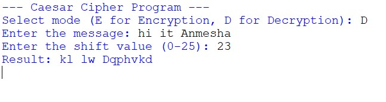

# PRODIGY_CS_01
Task Description
This project implements the Caesar Cipher algorithm to encrypt and decrypt text using a shift value.

## 🚀 Features
- Encrypt messages
- Decrypt messages
- Handles uppercase and lowercase letters
- Preserves spaces and special characters

## 💻 Technologies Used
- Python

## ⚙️ How It Works
The Caesar Cipher shifts each letter in the message by a fixed number (shift value).

Example:
A → D (Shift 3)
B → E

Encryption: Shift forward  
Decryption: Shift backward  

## ▶️ How to Run
1. Open terminal
2. Run:
   python Task-01.py
3. Enter message
4. Enter shift value
5. Choose encrypt or decrypt

## 📷 Output Screenshot

## 🧠 Learning Outcomes
- Learned basics of cryptography
- Understood Caesar Cipher logic
- Worked with ASCII values in Python

## 🔗 Author
Anmesha
